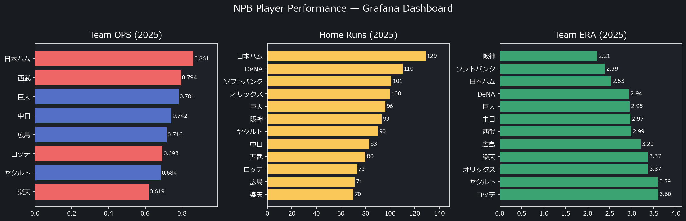
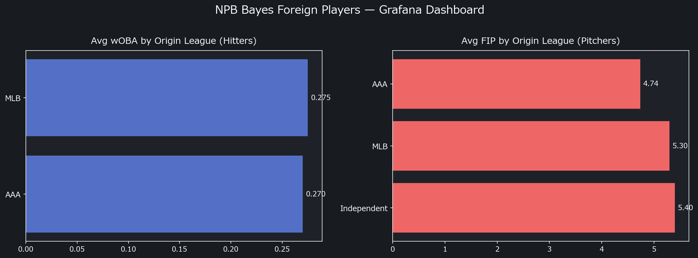

# npb-prediction

NPB（日本プロ野球）の選手成績予測・チーム勝率予測プロジェクト。

## 概要

**3段階の予測パイプライン：**

1. **選手レベル（日本人）** — 各選手の翌年成績（OPS・ERA等）を4層アンサンブルで予測
   - Marcel法（過去3年を5:4:3で加重平均 + 年齢調整）
   - Stan ベイズ補正（K%/BB%/BABIP/年齢のRidge補正）
   - 機械学習（XGBoost / LightGBM）
   - BMA（ベイズモデル平均）で統合 + 80%/95% 信頼区間
2. **選手レベル（外国人）** — 前リーグ成績 × Stan v2モデルで NPB初年度予測（全24選手個別予測）
3. **チームレベル** — モンテカルロ10,000回シミュレーション → P(優勝)/P(CS)/勝利数CI

### Marcel法とは
Tom Tangoが考案した統計的予測手法。直近年ほど重くなる比率（直近年5：2年前4：3年前3）で過去成績を加重平均し、「平均へ引き戻す効果（回帰）」と年齢ピーク調整を加えて翌年成績を推定します。セイバーメトリクスコミュニティで予測精度のベースラインとして使われています。

## Streamlit ダッシュボード（ブラウザで見る）

**https://npb-prediction.streamlit.app/**

日本語/英語対応のインタラクティブダッシュボード。インストール不要でブラウザから全機能を操作できます。

## Grafana ダッシュボード（メトリクス分析）

- [NPB Player Performance](https://yasumorishima.grafana.net/public-dashboards/c0534609e7994d69a651679e9802eb1b) — 12球団OPS/ERA/FIP比較、ピタゴラス勝率、年齢カーブ、Marcel予測精度
- [NPB Bayes Foreign Players](https://yasumorishima.grafana.net/public-dashboards/ba749845b16a451a876fa92bd5efd506) — 外国人選手ベイズ予測、出身リーグ別分析




BigQuery (`data-platform-490901.npb` / `npb_bayes`) に接続。

## FastAPI（プログラムから呼び出す）

Raspberry Pi 5 + Docker で常時稼働中（Tailscaleネットワーク内）。Cloud Run にも同一APIをデプロイ済み。

- **トップページ**: 打者 TOP3（wRC+順）+ 先発投手 TOP3（FIP順/投球回100以上）+ リリーフ投手 TOP3（FIP順/投球回20〜99）+ レーダーチャート + 用語説明（入力不要）
- **順位表**: セ・パ両リーグの予測順位（ピタゴラス勝率ベース）
- **打者ランキング**: OPS/AVG/HR/RBI/wOBA/wRC+ でソート
- **投手ランキング**: ERA/WHIP/SO/W/FIP/K%/BB%/K-BB%/K9/BB9/HR9 でソート
- **チーム勝率**: 12球団の予測勝率 + 信頼区間
- **打者予測**: クイックボタンで選手検索 + レーダーチャート + wOBA/wRC+/wRAA + 計算式解説
- **投手予測**: クイックボタンで選手検索 + レーダーチャート + FIP/K%/BB%/K-BB% + 計算式解説

## ファイル構成

| スクリプト | 内容 |
|---|---|
| `fetch_npb_data.py` | baseball-data.com から NPB成績を取得（2015-2025、打者+投手） |
| `fetch_npb_detailed.py` | npb.jp から詳細打撃成績を取得（2B/3B/SF含む、wOBA算出用） |
| `fetch_rosters.py` | baseball-data.com から年別NPB支配下登録選手一覧を取得（2018-2025） |
| `sabermetrics.py` | wOBA/wRC+/wRAA算出（NPBリーグ環境に合わせた係数） |
| `marcel_projection.py` | Marcel法による翌年成績予測（年齢調整付き） |
| `generate_historical_projections.py` | 過去年（2018-2025）のMarcel→ピタゴラス予測勝利数を生成（選手名鑑フィルタ適用済み） |
| `ml_projection.py` | XGBoost/LightGBM による成績予測（年齢+wOBA/wRC+特徴量付き） |
| `pythagorean.py` | ピタゴラス勝率によるチーム勝率予測（NPB最適指数 k=1.72） |
| `api.py` | FastAPI 推論API（全予測をREST APIで提供） |
| `load_to_bq.py` | BigQuery データロード（25テーブル、型変換・日本語カラム名変換付き） |
| `bqml_train.py` | BigQuery ML 学習・評価・予測ラッパー |
| `bayes_projection.py` | ベイズ予測エンジン（日本人Stan補正 + 外国人Stan v2 + BMA + CI） |
| `team_simulation.py` | モンテカルロ10,000回チーム勝率シミュレーション |
| `sql/` | BQML モデル定義 + 分析ビュー（5ファイル） |
| `DATA_SOURCES.md` | 全データソースの取得方法・URL・クレジット詳細 |
| `Dockerfile` | Docker コンテナ定義（Cloud Run + RPi5 両対応） |
| `docker-compose.yml` | Docker Compose 設定 |

### データ

| ファイル | 内容 |
|---|---|
| `data/raw/npb_hitters_2015_2025.csv` | 打者成績（2015-2025、11シーズン分、3,780行） |
| `data/raw/npb_pitchers_2015_2025.csv` | 投手成績（2015-2025、11シーズン分、3,773行） |
| `data/raw/npb_standings_2015_2025.csv` | 順位表（12球団×11年=132行） |
| `data/raw/npb_player_birthdays.csv` | 選手生年月日（年齢調整に使用、2,479人） |
| `data/raw/npb_batting_detailed_2015_2025.csv` | 詳細打撃成績（2塁打/3塁打/犠飛を含むwOBA算出用、4,538行） |
| `data/raw/npb_rosters_2018_2025.csv` | 支配下登録名鑑（MLB移籍・退団選手の除外判定に使用、7,866行） |
| `data/bayes/posteriors.json` | Stan事後分布パラメータ（beta/sigma/標準化統計/BMA重み） |
| `data/foreign/foreign_players_master.csv` | 外国人選手マスター（24人、英語名・出身リーグ・Web検証済み） |
| `data/foreign/foreign_prev_stats.csv` | 外国人前リーグ成績（全選手Web検証済み） |
| `data/foreign/conversion_factors.csv` | リーグ別MLB→NPB換算係数 |
| `data/projections/npb_sabermetrics_2015_2025.csv` | wOBA/wRC+/wRAA算出結果 |
| `data/projections/bayes_hitters_2026.csv` | 日本人打者ベイズ予測（463人、CI付き） |
| `data/projections/bayes_pitchers_2026.csv` | 日本人投手ベイズ予測（513人、CI付き） |
| `data/projections/foreign_hitters_2026.csv` | 外国人打者予測（8人、全員Stan v2） |
| `data/projections/foreign_pitchers_2026.csv` | 外国人投手予測（16人、全員Stan v2） |
| `data/projections/team_sim_2026.json` | チームモンテカルロ結果（勝率分布 + 確率） |
| `data/projections/` | その他予測結果CSV（Marcel法・ML・ピタゴラス勝率・セイバー） |

## 予測精度（バックテスト）

### Marcel法 vs XGBoost / LightGBM（2025年バックテスト）

同じ選手セット（打者PA≥100 / 投手IP≥30）で統一して比較。MAE = 実績との平均ズレ幅。数値が小さいほど予測が正確。

**打者 OPS MAE（低いほど良い、n=172）**

| モデル | OPS MAE | 評価 |
|---|---|---|
| Marcel法 | .063 | ★ |
| XGBoost | .063 | ★ |
| LightGBM | .066 | |

**投手 ERA MAE（低いほど良い、n=145）**

| モデル | ERA MAE | 評価 |
|---|---|---|
| **Marcel法** | **0.78** | **★ 優位** |
| XGBoost | 0.93 | |
| LightGBM | 0.92 | |

**結論: 打者OPSはMarcel≒ML（差なし）、投手ERAはMarcel優位（MAE 0.78 vs ML 0.92〜0.93）**

### ピタゴラス勝率（チーム順位予測の誤差）

得失点差から予測勝数を算出。NPBに合わせた指数（k=1.72）はMLB標準（k=1.83）より誤差が小さい。

| 指数 | MAE（平均誤差） | 対象 |
|---|---|---|
| NPB最適 (k=1.72) | **3.20勝** | 全12球団 2015-2025 |
| MLB標準 (k=1.83) | 3.32勝 | 同上 |

### wOBA/wRC+（自前算出）

NPB公式データ（npb.jp）からリーグ環境に合わせた係数でwOBA/wRC+を算出。

- **wOBA**（加重出塁率）: 0.310前後=平均、.380以上=優秀、.450以上=エリート
- **wRC+**（得点創出力+）: 100=リーグ平均、150以上=優秀、200以上=MVP級

| 選手 | 年度 | wOBA | wRC+ |
|---|---|---|---|
| 近藤健介 | 2024 | .479 | 249 |
| オースティン | 2024 | .478 | 248 |
| サンタナ | 2024 | .441 | 220 |

## 2026年予測 TOP5（Marcel法）

> **注意:** Marcel法は過去3年間（2023-2025）のNPBデータに基づく純粋な統計予測です。NPB公式2026ロースター（roster_2026.py）に在籍確認された選手のみを対象としています。MLB移籍済み選手・退団選手は除外済みです。

### 打者（OPS）
| 選手 | チーム | OPS | HR | RBI |
|---|---|---|---|---|
| 近藤健介 | ソフトバンク | .885 | 15 | 59 |
| 佐藤輝明 | 阪神 | .832 | 25 | 82 |
| レイエス | 日本ハム | .828 | 24 | 70 |
| 牧秀悟 | DeNA | .812 | 20 | 66 |
| 細川成也 | 中日 | .811 | 20 | 63 |

### 投手（ERA）
| 選手 | チーム | ERA | WHIP | SO |
|---|---|---|---|---|
| 才木浩人 | 阪神 | 1.99 | 1.07 | 123 |
| マルティネス | 巨人 | 2.01 | 1.02 | 54 |
| モイネロ | ソフトバンク | 2.01 | 1.01 | 125 |
| 宮城大弥 | オリックス | 2.29 | 1.01 | 139 |
| 東克樹 | DeNA | 2.35 | 1.12 | 107 |

### 2026年チーム予測順位（NPB 144試合制）

**セ・リーグ**
| 順位 | チーム | 予測勝数 |
|---|---|---|
| 1位 | 阪神 | 80.1 |
| 2位 | DeNA | 71.3 |
| 3位 | 巨人 | 70.7 |
| 4位 | 広島 | 70.4 |
| 5位 | 中日 | 68.8 |
| 6位 | ヤクルト | 64.3 |

**パ・リーグ**
| 順位 | チーム | 予測勝数 |
|---|---|---|
| 1位 | ソフトバンク | 80.5 |
| 2位 | 日本ハム | 76.8 |
| 3位 | オリックス | 73.8 |
| 4位 | 西武 | 68.6 |
| 5位 | ロッテ | 67.1 |
| 6位 | 楽天 | 65.5 |

> 予測フロー: 選手のwOBAを集計 → チーム得点を推定（wRAA） → 得失点差からピタゴラス勝率（k=1.72）で勝数を算出

## MLOps 構成

「予測スクリプトを作る」から「予測システムを運用する」への3本柱。

| 仕組み | 実装 | 効果 |
|---|---|---|
| **モデル保存** | `joblib` → `data/models/*.pkl` | 年度ごとのモデルを永続化。過去のモデルで再予測可能 |
| **精度記録** | `data/metrics/metrics_{year}.json` | Marcel vs ML のMAE推移を記録。「今年は改善したか」が分かる |
| **実験管理** | Weights & Biases (`npb-prediction` プロジェクト) | 毎年の学習ごとにMAE・特徴量重要度・Marcel比改善率を自動記録 |
| **自動実行** | GitHub Actions（毎年11月1日 + 手動） | データ取得→学習→保存→W&B記録→Gitコミットが全自動 |

### CI/CD パイプライン（`annual_update.yml`）

```
Step 1: fetch_npb_data.py       → 打者/投手成績スクレイプ
Step 2: fetch_npb_detailed.py   → 詳細打撃成績（wOBA算出用）
Step 3: pythagorean.py          → 順位表・ピタゴラス勝率
Step 4: sabermetrics.py         → wOBA/wRC+/wRAA算出
Step 5: marcel_projection.py    → Marcel法予測
Step 6: ml_projection.py        → ML予測 + モデル保存 + メトリクスJSON出力
Step 7: git commit & push       → data/ を自動コミット
Step 8: load_to_bq.py           → BigQuery に全データロード
Step 9: bqml_train.py           → BQML モデル学習・評価・予測
```

スケジュール: 毎年3月1日（FA・移籍確定後、開幕前）+ `workflow_dispatch`（手動実行）

> **⚠️ 手動実行時の注意**: `workflow_dispatch` で実行する場合は、`data_end_year` に前年（例: `2025`）を明示的に指定してください。空白のままだと当年（`2026`）が設定され、存在しないシーズンデータを取得しようとして予測値が崩壊します。

### `/metrics` エンドポイント

年次再学習のたびに記録される MAE 推移を返します。

```bash
curl http://localhost:8000/metrics
```

```json
{
  "件数": 1,
  "メトリクス": [{
    "year": 2026,
    "data_end_year": 2025,
    "generated_at": "2026-11-01T09:30:00",
    "hitter": {"lgb": 0.066, "xgb": 0.063, "ensemble": 0.064, "marcel": 0.063},
    "pitcher": {"lgb": 0.92, "xgb": 0.93, "ensemble": 0.92, "marcel": 0.78}
  }]
}
```

`hitter.lgb < hitter.marcel` ならMLがMarcelを上回っている。そうでなければMarcelを採用。

---

## 使い方

```bash
# データ取得（baseball-data.com から）
python fetch_npb_data.py

# 詳細打撃成績取得（npb.jp から）
python fetch_npb_detailed.py

# wOBA/wRC+算出
python sabermetrics.py

# Marcel法で予測
python marcel_projection.py

# XGBoost/LightGBM で予測（wOBA/wRC+特徴量含む）
python ml_projection.py

# ピタゴラス勝率で予測
python pythagorean.py
```

### API起動

```bash
# ローカル起動
pip install -r requirements.txt
uvicorn api:app --reload

# Docker起動
docker compose up --build
```

APIが起動したら http://localhost:8000/docs でSwagger UIを確認できます。

### APIエンドポイント

| メソッド | パス | 内容 |
|---|---|---|
| GET | `/predict/hitter/{name}` | 打者の翌年成績予測（Marcel + ML） |
| GET | `/predict/pitcher/{name}` | 投手の翌年成績予測（Marcel + ML） |
| GET | `/predict/team/{name}?year=2024` | チームのピタゴラス勝率 |
| GET | `/sabermetrics/{name}?year=2024` | wOBA/wRC+/wRAA |
| GET | `/rankings/hitters?top=10&sort_by=OPS` | 打者ランキング |
| GET | `/rankings/pitchers?top=10&sort_by=ERA` | 投手ランキング |
| GET | `/pythagorean?year=2024` | 全チームのピタゴラス勝率 |
| GET | `/metrics` | 年次MAE推移（Marcel vs ML） |

### レスポンス例

```bash
# 牧秀悟の翌年予測
curl http://localhost:8000/predict/hitter/牧
```

```json
{
  "query": "牧",
  "count": 1,
  "predictions": [{
    "player": "牧 秀悟",
    "team": "DeNA",
    "marcel": {"OPS": 0.834, "AVG": 0.295, "HR": 22.9, "RBI": 81.4},
    "ml": {"pred_OPS": 0.874}
  }]
}
```

## 実装済み機能

- [x] Marcel法（年齢調整付き）
- [x] ピタゴラス勝率（NPB最適指数 k=1.72）
- [x] XGBoost / LightGBM（年齢+wOBA/wRC+特徴量付き）
- [x] セイバー指標追加（wOBA/wRC+/wRAA自前算出）
- [x] FastAPI による推論API化 + Docker対応
- [x] Streamlit ダッシュボード（日本語/英語対応）
- [x] 2026ロースター反映（移籍・退団）
- [x] トップページに用語説明（OPS/wOBA/wRC+/FIP/K%/BB%/K-BB%/K9/BB9/HR9）を追加
- [x] 計算対象外選手（新人・新外国人）の可視化（バッジ表示・選手リスト）
- [x] 投手TOP3に総合投球力レーダーチャート追加（防御率/WHIP/奪三振/投球回/勝利の5軸）
- [x] 打者ランキングにwOBA/wRC+ソート追加
- [x] 投手ランキングにFIP/K%/BB%/K-BB%/K9/BB9/HR9ソート追加
- [x] 打者予測にwOBA/wRC+/wRAA + wRC+推移グラフ統合
- [x] 投手予測にFIP/K%/BB%/K-BB%/K9/BB9/HR9 + レーダーチャート追加
- [x] 全指標に計算式expander（式 + 基準値の解説）
- [x] NPBデータ年数バッジ表示（1年/2年の選手は予測精度に注意書き）
- [x] 打者レーダーチャート6軸化（HR/AVG/OBP/SLG/wOBA/wRC+）
- [x] 投手レーダーチャート7軸化（ERA/WHIP/奪三振/K9/BB9/HR9/FIP）
- [x] K/9・BB/9・HR/9にリーグ平均との差分表示追加
- [x] 打者TOP3のソートをwRC+順に変更（OPSから変更）
- [x] 投手TOP3を先発（投球回100以上）・リリーフ（20〜99）に分離しFIP順で表示
- [x] 棒グラフとレーダーチャートの指標を統一（打者: wOBA/wRC+、投手: FIP/K9/BB9/HR9）
- [x] Streamlitダッシュボード日本語/英語切替（サイドバートグル）
- [x] モバイル対応（レスポンシブCSS・縦積み・横スクロール・横向き棒グラフ）
- [x] CI/CD自動再学習（GitHub Actions 毎年3月1日）
- [x] モデルアーティファクト保存（`data/models/*.pkl`）
- [x] 精度メトリクス記録・API公開（`/metrics`）
- [x] W&B実験管理（毎年の学習ごとにMAE・Marcel比改善率を自動記録）
- [x] 歴史的バックテストのチーム割り当てバグ修正（FA・移籍選手が前年チームに計上されていた問題）
- [x] 選手名鑑フィルタ追加（退団・MLB移籍・引退選手を予測から除外、`npb_rosters_2018_2025.csv` 参照）
- [x] GCP分析基盤（BigQuery 25テーブル + BQML 4モデル + 10分析ビュー）
- [x] BigQuery ML でSQLだけで打者OPS/投手ERA予測（Boosted Tree + 線形回帰）
- [x] データ品質チェックビュー（欠損検知・カバレッジ確認）
- [x] Cloud Run対応 Dockerfile（PORT環境変数）
- [x] GCP Deploy ワークフロー（BigQuery + BQML + Cloud Run）
## 今後の予定

### ベイズ統合（最優先 — 7フェーズ計画）

[npb-bayes-projection](https://github.com/yasumorishima/npb-bayes-projection) で検証済みの Stan 階層ベイズモデルを本リポジトリに統合し、予測システムの構造を根本的に変更します。

**現状の課題:**
- 予測は点推定のみ（不確実性の表現がない）
- 新外国人選手は wRAA=0（リーグ平均）で処理（前リーグ成績を活かせていない）
- Marcel / ML が独立動作（統合的なアンサンブルがない）

**統合後の予測アーキテクチャ — 4層階層:**

```
Layer 1: Marcel（基盤）
  - 3年加重平均 + 平均回帰 + 年齢調整（変更なし）

Layer 2: Stan ベイズ補正
  - 日本人: Marcel に K%/BB%/BABIP/年齢 の Ridge 補正を加算
  - 外国人: 前リーグ成績からリーグ別ベイズ予測（v2: K%×BB%交互作用、異分散性）

Layer 3: ML（XGBoost/LightGBM）
  - Stan 補正値を追加特徴量として取り込み

Layer 4: ベイズモデル平均（BMA）
  - LOO-CV で毎年自動キャリブレーションされる重み
  - 全予測に 80%/95% 信頼区間を付与
  → 選手の不確実性がモンテカルロチームシミュレーションに伝播
```

**研究成果（[npb-bayes-projection](https://github.com/yasumorishima/npb-bayes-projection) で検証済み）:**

| 指標 | n | Marcel MAE | Stan MAE | p値 | Bootstrap |
|---|---|---|---|---|---|
| 打者 wOBA | 2,208 | 0.05023 | 0.04980 | 0.060 | 97.1% |
| 投手 ERA | 2,164 | 1.23008 | 1.22241 | 0.057 | 97.1% |

- BABIP 回帰効果 δ=-0.006（p=0.0004）が打者最強シグナル
- ERA + K/9 + BB/9（5特徴量）で p=0.012 達成
- MLB→NPB 換算係数: wOBA ×1.235、ERA ×0.579（bootstrap 95% CI 付き）
- チーム予測: Monte Carlo 10,000回シミュレーション、パークファクター5年移動平均で CI coverage 86.5→87.5% 改善

**実装フェーズ:**

| Phase | 内容 | 状態 |
|---|---|---|
| 1. 基盤 | 日本人ベイズ推論（posteriors.json + NumPy サンプリング） | **完了** |
| 2. 外国人 | 前リーグ成績ベースのベイズ予測（全24選手Web検証済み） | **完了** |
| 3. チーム | モンテカルロ勝率シミュレーション + パークファクター補正 | **完了** |
| 4. 学習 | Stan 学習パイプライン（GitHub Actions で年次実行） | 未着手 |
| 5. API | CI 付きレスポンス + 外国人エンドポイント + 順位シミュレーション | 未着手 |
| 6. Streamlit | ファンチャート、密度プロット、外国人ページ、不確実性分析ページ | 未着手 |
| 7. BigQuery | 新テーブル5本（ベイズ予測・外国人・シミュレーション・事後分布） | 未着手 |

**設計上の重要な判断:**
- **Stan はランタイムで動かさない** — GitHub Actions で学習、本番は NumPy 事後サンプリング（RPi5 4GB RAM 対応）
- **BMA 重みは毎年自動更新** — LOO-CV で再計算し posteriors.json に保存（自己キャリブレーション）
- **不確実性がエンドツーエンドで伝播** — 選手 CI → チーム Monte Carlo → 優勝確率

### その他

- [ ] Marcel重みをNPBデータ最適化値に更新（打者 8/4/3・REG_PA=2000 / 投手 4/5/2・REG_IP=800、ブートストラップ p=0.003 で有意）→ [npb-marcel-weight-study](https://github.com/yasumorishima/npb-marcel-weight-study)
- [x] BQML精度検証 — BQML（BT: OPS MAE 0.0642 / ERA MAE 0.909）は Python ML（OPS ~0.065 / ERA 0.92-0.93）と同等以上。特徴量もBQMLの方が豊富（パークファクター・DIPS・FIP近似・Marcel加重平均等）。両手法とも投手ERAではMarcel法（0.78）に及ばず、これはML共通の課題
- [ ] 精度が悪化したときの自動アラート

### Marcel法のもう一つの限界: NPB在籍1〜2年の選手

NPBデータが1〜2年しかない選手（2年目外国人・復帰直後の選手など）は、Marcel法のリーグ平均への回帰が強く働きます。

- データ**1年のみ**（例: 60IPの外国人投手）→ 予測値の約**2/3**がリーグ平均に引き寄せられる
- データ**2年のみ** → 予測値の約**半分**がリーグ平均に引き寄せられる

「計算対象外」ではなく予測値は出ますが、実力の過小/過大評価が起きやすいです。Streamlitアプリでは選手名横に **「NPB1年」「NPB2年」** バッジを表示しています。

### Marcel法のもう一つの限界: 若手の急成長

Marcel法の年齢調整は **+0.3%/年（27歳ピーク基準）** と非常に小さく、急激な成長には追いつきません。

23〜26歳の選手が「殻を破る」ような場合、モデルは過去3年の平均に引き戻すため、実際の成績を大幅に下回る予測になります。新外国人・新人と同様に、**若手ブレイク候補が多いチームほどモデルの予測は保守的に出る**傾向があります。

## データソース

**このプロジェクトのNPBデータは以下のサイトから取得しています：**

- [プロ野球データFreak](https://baseball-data.com) — NPB選手成績・生年月日（2015-2025）
- [日本野球機構 NPB](https://npb.jp) — 詳細打撃成績（2B/3B/SF、wOBA/wRC+算出用）

詳細は [DATA_SOURCES.md](DATA_SOURCES.md) を参照。

### GCP 分析基盤（BigQuery + BigQuery ML + Cloud Run）

全データを Google BigQuery に集約し、SQL だけで分析・ML学習・予測が完結する基盤を構築しています。

> **開発経緯の注記**: 通常の実務フローでは BQML（SQL）でプロトタイプ → Python で本番化という順序ですが、本プロジェクトは GCP 未使用の状態で開発を始めたため Python 本番モデル（LightGBM/XGBoost）が先に充実しました。現在は逆方向に、BQML の精度を Python 版に揃えていく段階です。

| 項目 | 値 |
|---|---|
| GCP プロジェクト | `data-platform-490901` |
| データセット | `npb` |
| テーブル数 | 25（40,229行） |
| BQML モデル | 4（打者 OPS × 2 + 投手 ERA × 2） |
| 分析ビュー | 10（トレンド・品質チェック・年齢カーブ等） |
| Cloud Run API | デプロイ済み（認証付き） |

#### データテーブル

| テーブル | 内容 | 行数 |
|---|---|---|
| `raw_hitters` | 打者成績（2015-2025） | 3,780 |
| `raw_pitchers` | 投手成績（2015-2025） | 3,773 |
| `raw_batting_detailed` | 詳細打撃成績（wOBA算出用） | 5,115 |
| `sabermetrics` | wOBA/wRC+/wRAA | 5,115 |
| `raw_standings` | 順位表 | 132 |
| `park_factors` | パークファクター | 120 |
| `raw_games_20XX` | 年度別試合結果（10テーブル） | 8,599 |
| `marcel_hitters` / `ml_hitters` | 打者予測（Marcel/ML） | 463 / 468 |
| `marcel_pitchers` / `ml_pitchers` | 投手予測（Marcel/ML） | 513 / 513 |

#### BigQuery ML モデル

SQL ウインドウ関数で特徴量を構築し、BQML で学習。Python 版と同等以上の精度を達成済み（打者 OPS MAE: BQML 0.0642 vs Python 0.065、投手 ERA MAE: BQML 0.909 vs Python 0.92）。

| モデル | ターゲット | タイプ |
|---|---|---|
| `bqml_batter_ops` | 翌年 OPS | Boosted Tree Regressor |
| `bqml_batter_ops_linear` | 翌年 OPS | 線形回帰 |
| `bqml_pitcher_era` | 翌年 ERA | Boosted Tree Regressor |
| `bqml_pitcher_era_linear` | 翌年 ERA | 線形回帰 |

特徴量: y1/y2/y3 ラグ + 差分トレンド + 比率指標（K9/BB9/HR9等）+ 年齢カーブ + パークファクター + チーム/リーグ変更フラグ + Marcel加重平均

#### 分析ビュー

| ビュー | 用途 |
|---|---|
| `v_batter_trend` | 選手年度別 OPS/wOBA トレンド（前年比付き） |
| `v_pitcher_trend` | 選手年度別 ERA/WHIP トレンド + FIP近似 |
| `v_team_pythagorean` | チーム勝率 vs ピタゴラス期待勝率（運要素の定量化） |
| `v_sabermetrics_leaders` | wRC+ リーダーボード（年度別順位付き） |
| `v_marcel_accuracy` | Marcel法の過去精度検証（予測 vs 実績） |
| `v_age_curve` | NPB全体の年齢カーブ（OPS/wOBA × 年齢） |
| `v_park_effects` | パークファクター影響分析 |
| `v_data_coverage` | シーズン別データカバレッジ（欠損検知用） |
| `v_data_quality` | テーブル別 NULL/欠損値サマリー |

```sql
-- 例: 2025年 wRC+ TOP10
SELECT player, team, season, wRC_plus, wOBA, OPS
FROM `data-platform-490901.npb.v_sabermetrics_leaders`
WHERE season = 2025
ORDER BY wrc_rank
LIMIT 10;

-- 例: NPB年齢カーブ（ピーク年齢の確認）
SELECT age, n_players, ROUND(avg_ops, 3) AS avg_ops
FROM `data-platform-490901.npb.v_age_curve`
WHERE n_players >= 20
ORDER BY avg_ops DESC
LIMIT 5;
```

> BigQuery無料枠（毎月1TBクエリ + 10GBストレージ）で利用できます。現在の使用量は約5MB（無料枠の0.05%）。

## License

MIT
