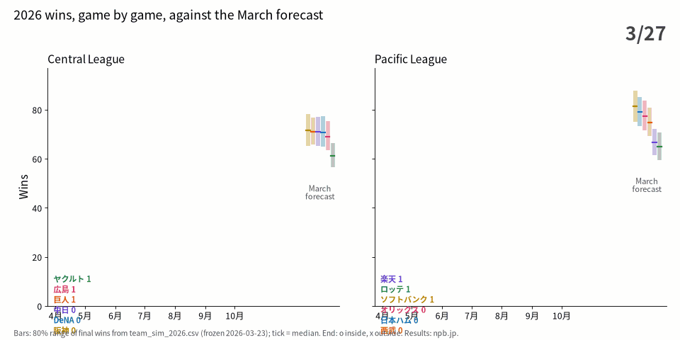

# 2026 チーム予測の判定（事前登録 `2026_team_prereg.md` のとおり）

## 入力

| 何を | 値 |
|---|---|
| 予測 | `data/projections/team_sim_2026.csv`（commit `f32c36a8`・2026-03-23 21:56 UTC・開幕前） |
| 最終順位表 | baseball-data.com・**2026-10-09 01:23:22 UTC 取得** |
| 照合 | npb.jp の全 858 試合（最終 2026-10-08）から勝敗分を数え直し、12 球団とも baseball-data.com と一致してから採点 |
| 消化試合数 | **12 球団とも 143**（X4 の併記事項なし） |

| リーグ | 球団 | 予測 `median_wins` | 最終勝利 | 80% 区間 | 95% 区間 |
|---|---|---|---|---|---|
| CL | 阪神 | 71.5 | 79 | 65.3〜78.2 ✕ | 62.1〜82.0 ○ |
| CL | 巨人 | 71.1 | 76 | 65.7〜76.8 ○ | 63.0〜80.1 ○ |
| CL | DeNA | 70.7 | 71 | 64.9〜77.3 ○ | 62.0〜80.7 ○ |
| CL | ヤクルト | 61.2 | 61 | 56.5〜66.3 ○ | 54.2〜69.2 ○ |
| CL | 広島 | 69.1 | 61 | 63.4〜75.4 ✕ | 60.6〜78.8 ○ |
| CL | 中日 | 71.0 | 60 | 65.2〜77.0 ✕ | 62.5〜80.3 ✕ |
| PL | ソフトバンク | 81.3 | 91 | 75.2〜87.8 ✕ | 72.1〜91.5 ○ |
| PL | 西武 | 74.9 | 79 | 69.2〜80.9 ○ | 66.2〜84.2 ○ |
| PL | 日本ハム | 79.1 | 78 | 73.3〜85.1 ○ | 70.6〜88.4 ○ |
| PL | オリックス | 77.5 | 65 | 71.6〜83.8 ✕ | 68.7〜87.0 ✕ |
| PL | ロッテ | 64.9 | 63 | 59.5〜70.8 ○ | 56.9〜74.3 ○ |
| PL | 楽天 | 66.7 | 58 | 61.6〜72.1 ✕ | 58.9〜75.1 ✕ |

優勝＝阪神（CL）・ソフトバンク（PL）。最下位＝中日（CL・60 勝、ヤクルトと 1 勝差）・楽天（PL）。

## 統計量

| | 値 | 床 |
|---|---|---|
| **主 T1** `median_wins` の MAE | **5.833 勝** | F1 定数 8.833 ／ F2 前年 5.917 ／ **F3 ピタゴラス 5.818** |
| （参考）`mean_wins` の MAE | 5.842 | |
| T2 Spearman 全 12 球団 | 0.758 | |
| T2 Spearman CL | 0.638（予測の幅 61.2〜71.5・実際の幅 60〜79） | |
| T2 Spearman PL | 0.771（予測の幅 64.9〜81.3・実際の幅 58〜91） | |
| T3 `p_pennant` Brier | **0.0892** | 一様 1/6：0.1389 |
| T4 `p_last` Brier | **0.1906** | 一様 1/6：0.1389 |
| T5 80% 区間の被覆 | **k = 6 / 12** | 受容域 7〜12 |
| T5 95% 区間の被覆 | **k = 9 / 12** | 受容域 10〜12 |

F3 は `pythagorean.py` と同じく「2025 年の得失点からの勝率 × 2025 年の勝+敗」。試合数（143）に掛けると 6.304 になるが、事前登録が指したのは `pythagorean.py` の定義なので 5.818 を床とする。

## 読み（R1〜R5・A1〜A2 の言い回しのとおり）

- **R1／R2**：T1（5.833）は F1・F2 には勝ったが **F3 ピタゴラス（5.818）に 0.015 勝負けた**。⇒ **この 12 球団・この 1 シーズンでは、T1 の MAE の絶対値には意味が無い**（A1 の射程）。R2 の条件（3 つの床すべてに勝つ）は満たしていないので「チーム予測は 2026 で働いた」とは書かない。差が 0.015 勝と小さいことは事実として併記するが、それで判定を変えない（X1・X2）。
- **R3**：T3（0.0892）は一様床 0.1389 より小さい＝**優勝確率はこの標本で一様床に勝った**。T4（0.1906）は一様床より大きい＝**最下位確率はこの 12 球団・この 1 シーズンでは情報を持たなかった**（A1 の射程）。最下位確率が最も高かったのはヤクルト 0.781 とロッテ 0.591 で、実際の最下位は中日（0.037）と楽天（0.375）。
- **R4／A2**：80% 区間は **k = 6（≤ 6）＝区間が狭すぎる**。95% 区間も **k = 9（≤ 9）＝区間が狭すぎる**。外れた球団は上に 2（阪神・ソフトバンク）、下に 4（広島・中日・オリックス・楽天）。
- **R5**：Spearman 0.758（CL 0.638・PL 0.771）は単独の成功根拠にしない。CL は予測の幅 10.3 勝（ヤクルトを除く 5 球団は 2.4 勝）に対し実際の幅 19 勝、PL は予測 16.4 勝に対し実際 33 勝＝**予測は球団間の差を実際の半分ほどにしか見ていない**。

## 参照値との比較

2021 年の同じ器械での T1 は 10.90 勝（追補 A3 で入力を固定）。2026 の 5.833 はそれより小さいが、2026 は床（F3）も 5.818 であり、年ごとの難しさが違うので器械の改善とは読まない。

## 検算

`score_team.py` の出力（`score2026.json`）とは別に、同じ 3 ファイルから pandas で T1・F1〜F3・T3・T4・T5・T2 を計算し直し、全項目が一致した（F3 は勝+敗基準）。

## 次（null は事実として記録し、次の手へ）

- **区間が両方の水準で狭い**。打者・投手の個人予測では区間が広すぎた（PR #2 で σ を出場機会の関数にした）のと逆向き。
- コードで確かめた事実（`research/stan/src/team_sim.py`）：2026 予測を出した `simulate()` の揺らぎは、**選手ごとに独立な正規ノイズ**（OPS σ 0.063・ERA σ 0.78）と**入れ替わり率に比例するノイズ**の 2 つ。バックテスト用の経路（329 行）にある**チーム水準の得失点の揺らぎ `SIGMA_RS_HIST` 64.2 / `SIGMA_RA_HIST` 62.5（96 チーム年の実測）は 2026 の予測経路では使われていない**。選手ごとの独立なノイズは 1 チームの中で足し合わされると打ち消し合うので、チームの勝利数の幅が小さく出る向きに働く。
- ⇒ 次は、2015〜2025 の各年で `simulate()` の 80%／95% 被覆 k を数え、狭さが毎年のものか 2026 だけかを先に測る。毎年なら、チーム水準の揺らぎを予測経路にも入れた版を**同じバックテストで k を見てから**採否を決める（2026 の結果を見て係数を選ばない）。
- **予測の幅が実際の約半分**（CL 10.3 対 19・PL 16.4 対 33）。上と同じバックテストで、予測の幅と実際の幅の比が毎年どうだったかも併せて測る。

出典: baseball-data.com（最終順位表）・npb.jp（試合結果）
